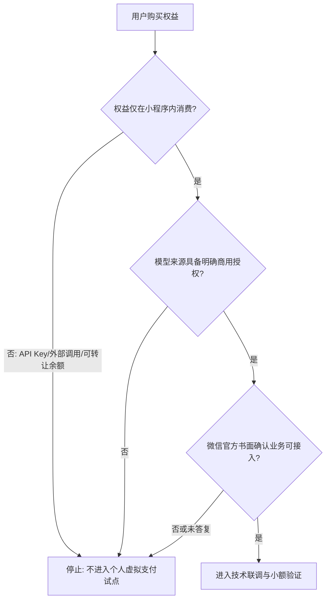
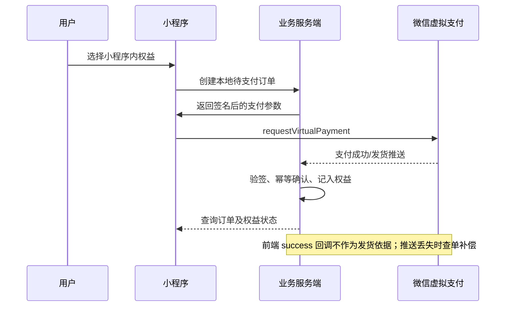

# 个人小程序虚拟支付试点方案

> 目的：验证封闭式 AI 工具的小程序内付费体验，不将 Sub2API 的 API Key、外部调用额度或可转让余额直接用于收费。
>
> 本文是产品与技术实施清单，不构成法律、税务、支付或上游服务条款意见。平台审核及书面答复优先于本文。

## 1. 决策边界

当前 Sub2API 的公开形态包含 API Key 分发、模型调用转发和按量计费。它不应直接接入个人小程序虚拟支付。

试点产品必须是一个独立、封闭的小程序 AI 工具：用户购买的仅是该小程序内不可转赠、不可提现、不可在外部客户端使用的功能次数或会员权益。

### 可售内容

- 小程序内的固定次数 AI 辅助功能，例如改写、摘要、学习反馈。
- 仅在小程序内生效的会员权益，例如更高的每日次数上限。
- 购买后立即绑定当前小程序用户；不支持转让、提现、兑换现金或外部 API 使用。

### 明确排除

- 向用户发放 API Key、OpenAI 兼容地址或第三方模型账号。
- 售卖可在网页、CLI、IDE、其他应用中消费的调用额度。
- 使用个人 OAuth、个人订阅或不具备商业/转售许可的上游账号提供付费服务。
- 将支付后的“点数”设计为可赠送、交易、提现或跨产品流通的余额。

## 2. 上线闸门

在开发支付前，向微信虚拟支付官方支持提交真实业务描述，并保留工单或邮件的书面回复。描述至少包括：

- 小程序主体、服务类目“工具”、认证和备案状态。
- 用户购买的具体权益及其在小程序内的消费路径。
- 不提供 API Key、不支持外部调用、不转赠、不提现的产品约束。
- 模型提供方、商业授权来源、内容安全与用户投诉处理方式。

未获得明确可接入的书面回复时，仅可完成不收费的产品开发与沙箱验证，不发布真实付费入口。

## 3. 试点流程

### 阶段与退出条件

| 阶段 | 目标 | 完成标准 | 立即停止条件 |
| --- | --- | --- | --- |
| 0. 业务确认 | 确认试点边界 | 微信官方书面确认，且上游商业授权可核验 | 业务被认定为 API 中转、信息查询或需额外资质 |
| 1. 沙箱联调 | 跑通技术链路 | 创建订单、签名、回调验签、幂等发货、主动查单均通过 | 回调无法可靠验签或权益可被重复发放 |
| 2. 小额真单 | 验证真实支付与结算 | Android 小额订单完成支付、到账、退款及账单核对 | 风控/尽调通知、资金异常或投诉无法处理 |
| 3. 封闭试用 | 验证产品体验 | 白名单用户少量使用，监控错误、退款、投诉 | 出现外部 API 使用、转赠套利或内容安全事件 |
| 4. 再决策 | 判断是否扩大 | 完成合规复核、成本核算和客服预案 | 未完成主体、授权或合规准备 |

## 4. 产品与工程清单

- [ ] 小程序功能与 Sub2API 的公开 API 网关解耦；用户不接触 API Key。
- [ ] 权益账本按用户和订单绑定，包含幂等键、过期策略、消费记录与退款冲正。
- [ ] 服务端实现虚拟支付签名、支付/发货推送验签、订单查单补偿和退款通知处理。
- [ ] 仅在确认允许的终端开支付；iOS 单独评估 12% 费率、退款机制及约 45-60 天结算周期。
- [ ] 配置用户协议、隐私政策、退款规则、客服和投诉处理入口。
- [ ] 配置内容安全策略、速率限制、异常使用告警和人工停用能力。
- [ ] 保存微信审核材料、支付订单、发货记录、退款与投诉处理记录。

## 5. 成本与运营约束

- 个人主体小程序虚拟支付月支付限额为 10 万元；不要以此作为可长期扩张的支付架构。
- Android 等终端腾讯技术服务费为 1%；iOS 为 12%，并且结算明显更慢。
- 试点先只开 Android 等终端的小额真实订单；iOS 在产品模型和现金流可接受后再单独接入。
- 支付成功不等于合规完成。微信审核、支付尽调、上游条款和监管义务均可能在后续触发。

## 6. 试点成功的定义

试点成功不是“支付接口返回成功”，而是同时满足以下条件：

1. 微信官方对真实业务给出可接入的书面确认。
2. 用户只能在小程序内使用已购买权益，无法取得或使用外部 API 调用能力。
3. 支付、推送、查单、退款、账单核对和权益冲正能够闭环。
4. 模型来源与商业授权可证明，且内容安全、隐私和客服流程可实际执行。
5. 小额真实订单完成后未出现风控、尽调、投诉处理失败或资金异常。

## 参考

- [微信小程序虚拟支付：个人](https://developers.weixin.qq.com/miniprogram/dev/platform-capabilities/business-capabilities/virtual-payment/person.html)
- [项目支付配置指南](PAYMENT_CN.md)
- [项目部署与运营合规承诺](legal/admin-compliance.zh.md)
