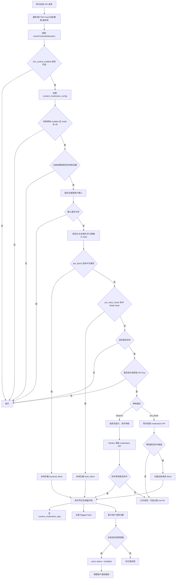
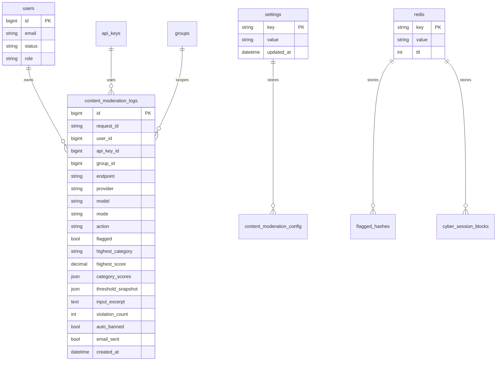
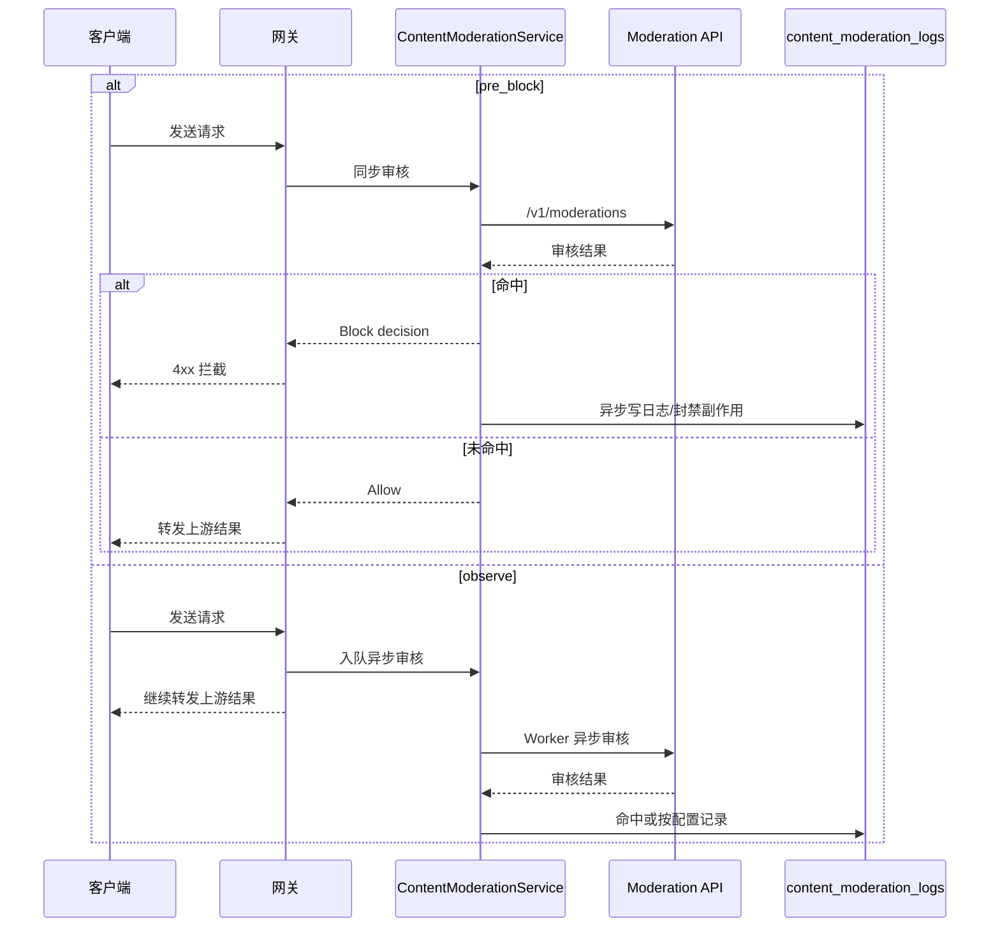
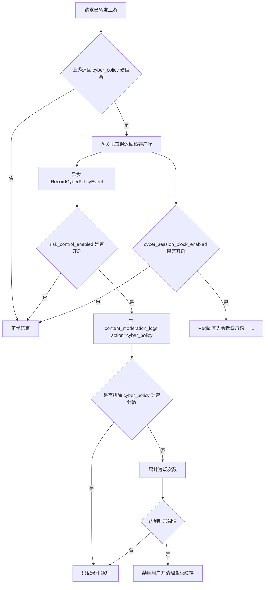
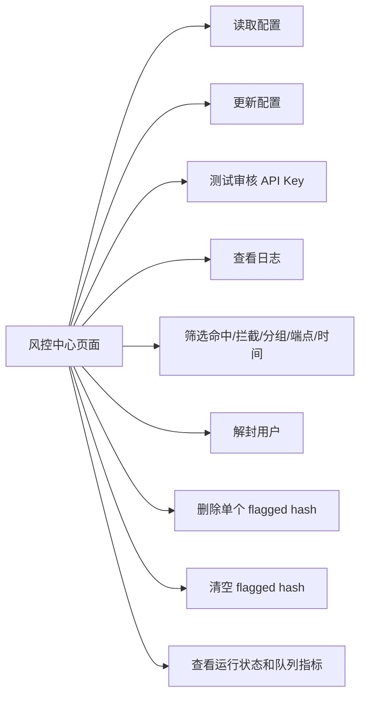

# 当前风控流程

更新日期：2026-06-26
适用对象：Sub2API 当前代码实现

## 一、定位

当前项目已有的风控主要是“内容审核风控”，不是完整的用户风险画像系统。

它解决的问题是：

- 对请求内容做审核。
- 命中风险内容时拦截或记录。
- 累计违规后自动禁用用户。
- 后台查看日志、测试审核 Key、解封用户。

## 二、整体流程



## 三、数据流

```mermaid
flowchart LR
    A[settings.risk_control_enabled] --> B[风控总开关]
    C[settings.content_moderation_config] --> D[审核配置 JSON]
    D --> E[ContentModerationService]
    E --> F[OpenAI /v1/moderations]
    E --> G[content_moderation_logs]
    E --> H[Redis content_moderation:flagged_hashes]
    E --> I[users.status]
    E --> J[API Key 鉴权缓存失效]

    K[后台 RiskControlView] --> L[/admin/risk-control/config]
    K --> M[/admin/risk-control/status]
    K --> N[/admin/risk-control/logs]
    K --> O[/admin/risk-control/users/:id/unban]
```

## 四、核心存储



## 五、模式差异



## 六、cyber_policy 旁路



## 七、后台能力



## 八、当前边界

当前实现已经形成小闭环：

- 请求审核。
- 命中拦截或观察。
- 写审计日志。
- 累计违规。
- 自动禁用用户。
- 后台人工解封。

当前没有完整实现：

- 用户风险等级表。
- 独立风控动作表。
- 用户/IP/设备/支付账户画像。
- 按风险等级自动调整额度。
- 专门的人工复核工单流。

因此，当前机制适合先防“内容违规导致上游风险”，但还不是完整的“平台滥用风控系统”。
