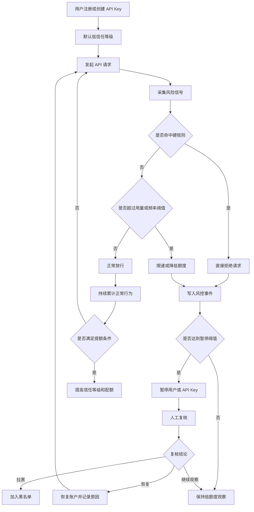
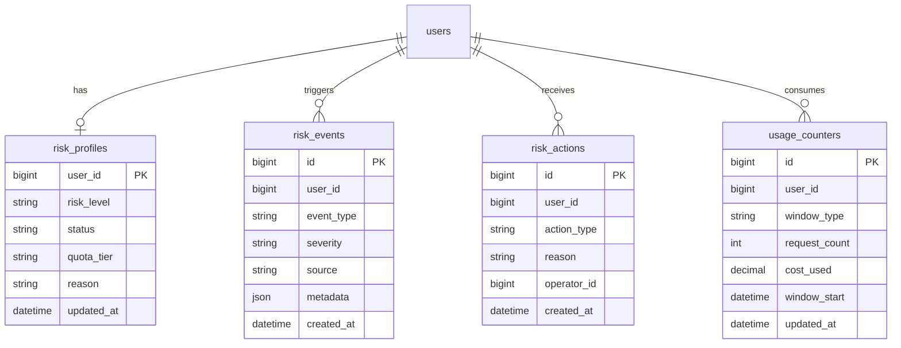
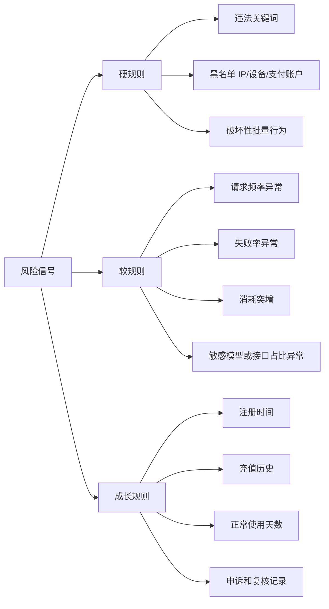
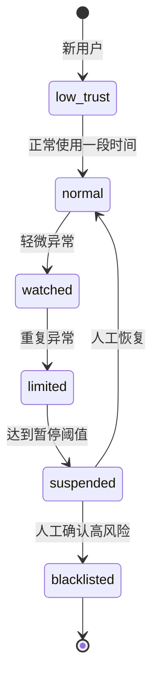

# 标准风控机制

更新日期：2026-06-26
适用对象：Sub2API 自营实例

## 一、目标

用最小闭环降低劣质用户造成的平台封号、资金损失和合规风险。

核心闭环：

- 识别风险
- 限制风险
- 暂停风险
- 人工复核
- 沉淀规则

## 二、推荐流程

## 三、关键数据模型

较小闭环建议优先落 4 类数据，其中请求日志如已有可复用。

## 四、规则分层

## 五、动作优先级

建议动作顺序：

1. 先限速，不立即封禁。
2. 再降额度，减少损失面。
3. 多次或高危命中后暂停。
4. 由人工恢复、拉黑或继续观察。
5. 每次动作都写原因码，方便复盘。

## 六、最小落地版本

第一版只做这些：

- 新用户低信任等级。
- 每用户每日额度和请求频率上限。
- 命中硬规则直接拒绝。
- 多次命中后暂停用户。
- 后台能查看事件并手动恢复。

暂不建议第一版做复杂模型评分。先用规则、阈值、审计日志跑出真实样本，再迭代。
